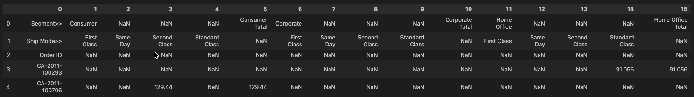
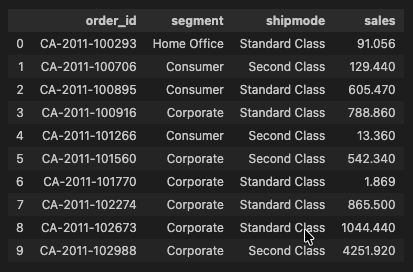

# Messy Dataset → Clean Tabular Data (Notebook Practice)

This repository documents my practice of working with messy, real-world datasets using Python notebooks.

The project focuses on understanding data structure first, then using **pandas** for structured data manipulation, with **NumPy** providing the underlying numerical computation for aggregation, vectorized operations, and handling missing values.

This is a learning project — not an attempt at the most optimized or “clever” solution.

---

## Dataset Overview

The dataset is intentionally messy and closer to what appears in real business files:

- metadata spread across multiple rows  
- implicit meaning encoded in columns  
- missing values (`NaN`) representing invalid combinations  
- no single row representing a complete record  

### Raw dataset

---

## Goal

Convert the dataset into a **clean, row-wise tabular format**, where:
- each row represents one logical record  
- metadata is made explicit  
- missing / invalid combinations are ignored  

### Clean output

---

## Approach (Questions I Asked)

Instead of jumping directly to pandas shortcuts, I tried to reason about the structure first.

- Which rows describe metadata vs actual data?  
- What does each column *really* represent?  
- When does a `NaN` mean “missing data” vs “invalid combination”?  
- Should I reshape first or reconstruct rows manually?  
- How do I avoid generating incorrect records?  

### Implementation Summary
- separated metadata rows from data rows  
- manually mapped column meaning  
- iterated only over v
